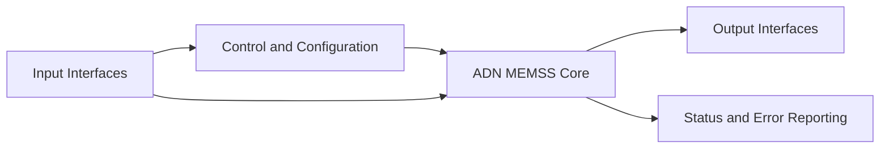

# ADN MEMSS Design Specification

## Theory

# Memory Subsystem 

A **memory subsystem** is the part of a processor-based system that manages communication between the processor and memory. It receives memory access requests from the processor, decodes the requested operation, controls the access sequence, and returns the required data or completion status. The subsystem supports normal **load and store operations** as well as **atomic memory operations**. **Load-Reserved (LR)** and **Store-Conditional (SC)** are used to implement synchronization primitives. LR loads a value from a memory location while establishing a reservation on that location. A subsequent SC attempts to store a new value only if the reservation is still valid. The SC therefore succeeds or fails depending on whether the monitored location has been modified by another access. **Atomic Memory Operations (AMOs)** perform a read-modify-write operation as a single atomic transaction. The memory subsystem reads the original value, performs the required operation such as **swap, add, AND, OR, XOR, minimum, or maximum**, and writes the result back to memory without allowing another transaction to interfere with the atomic sequence. The memory subsystem also provides **interface and data-width adaptation** between the processor and physical memory. A width-conversion stage can split or combine memory transfers when the processor-side and memory-side data widths are different, while same-width accesses can pass through directly.

Overall, the memory subsystem provides a reliable and reusable interface between the **CPU and physical memory**, handling **load/store accesses, LR/SC synchronization, AMO atomic operations, request sequencing, response generation, and memory-width conversion**, while keeping the processor-side control logic independent of the underlying memory implementation.
## Questions and Answers

| Question | Answer |
| --- | --- |
| What problem does the design solve? | _Add answer._ |
| What are the clock and reset requirements? | _Add answer._ |
| What are the supported operating modes? | _Add answer._ |
| What are the error and boundary conditions? | _Add answer._ |
| What verification evidence is required? | _Add answer._ |

## Block Diagram



_Update the diagram with the final module names, interfaces, clocks, resets, and data paths._

## Architectural Decision

### Proposal_1

_Describe the first architectural option, including its implementation approach, benefits, limitations, and estimated cost._

### Proposal_2

_Describe the second architectural option, including its implementation approach, benefits, limitations, and estimated cost._

### Approved_Proposal

- **Selected proposal:** _Proposal_1 or Proposal_2._
- **Decision owner:** _Name or team._
- **Decision date:** _YYYY-MM-DD._
- **Rationale:** _Explain why this proposal was approved._
- **Consequences:** _Document expected trade-offs and follow-up actions._

## Verification

### Debug Issues and Solutions

| Serial No. | Debug issue | Solution | 
| --- | --- | --- | 
| 01 | *Describe the issue.* | *Describe the fix.* | 
| 02 | *Describe the issue.* | *Describe the fix.* | 

### Verification Checklist

- [ ] RTL compiles without errors or unexpected warnings.
- [ ] Reset behavior is verified.
- [ ] Normal operating scenarios are covered.
- [ ] Boundary and error conditions are covered.
- [ ] Assertions pass.
- [ ] Regression passes.
- [ ] Coverage results meet the project target.

## Project Outcome

Summarize the completed implementation, verification results, known limitations, and any recommended future work.

- **Implementation status:** _Not started / In progress / Complete._
- **Verification status:** _Not started / In progress / Complete._
- **Known limitations:** _Add limitations._
- **Follow-up work:** _Add follow-up items._

## Simulation Command

Run the default simulation with:

```bash
make simulate TOP=<top_module_name> TN=<test_case_name> TC=<test_count> VCD=<0|1> DEBUG=<0|1> GUI=<0|1>
```

Examples:

```bash
# Run a test case in batch mode.
make simulate TOP=dummy_tb TN=default TC=1 VCD=0 DEBUG=0 GUI=0

# Run the simulation with the graphical interface.
make simulate TOP=dummy_tb TN=default TC=1 VCD=1 DEBUG=1 GUI=1
```

_Record the exact command, tool version, and result used for the approved verification run._
