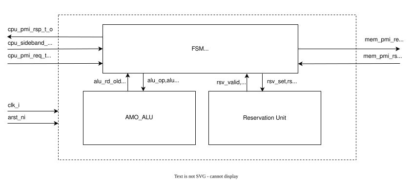
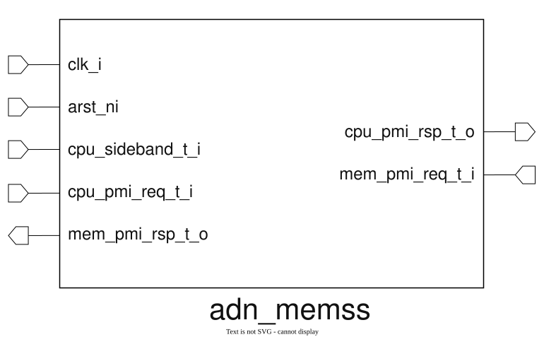
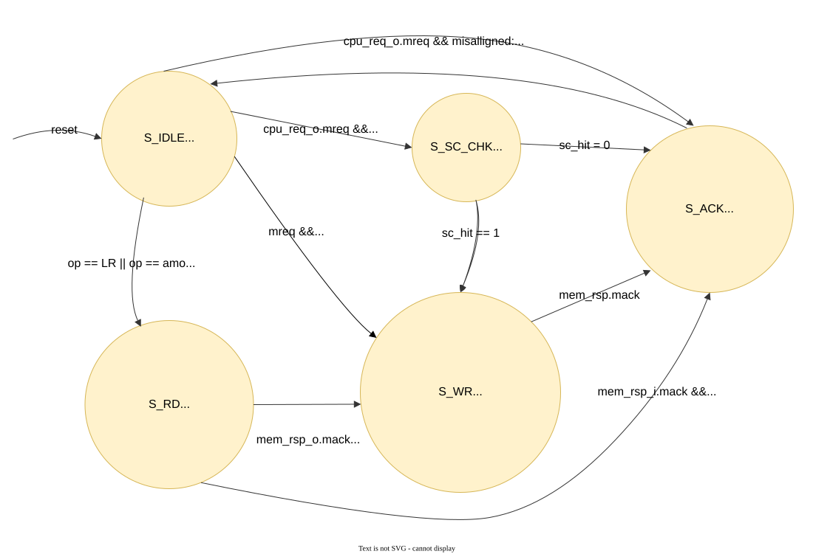

# ADN MEMSS Design Specification

## Theory

# Memory Subsystem 

A **memory subsystem** is the part of a processor-based system that manages communication between the processor and a shared memory. It receives memory access requests from multiple processors, decodes the requested operation, controls the access sequence, and returns the required data and completion status. The subsystem supports normal **load and store operations** as well as **atomic memory operations**. **Load-Reserved (LR)** and **Store-Conditional (SC)** are used to implement synchronization primitives. LR loads a value from a memory location while establishing a reservation on that location. A subsequent SC attempts to store a new value only if the reservation is still valid. The SC therefore succeeds or fails depending on whether the monitored location has been modified by another access. **Atomic Memory Operations (AMOs)** perform a read-modify-write operation as a single atomic transaction. The memory subsystem reads the original value, performs the required operation such as **swap, add, AND, OR, XOR, minimum, or maximum**, and writes the result back to memory without allowing another transaction to interfere with the atomic sequence. The memory subsystem also provides **interface and data-width adaptation** between the processor and physical memory. A width-conversion stage can split or combine memory transfers when the processor-side and memory-side data widths are different, while same-width accesses can pass through directly.

Overall, the memory subsystem provides a reliable and reusable interface between the **CPU and physical memory**, handling **load/store accesses, LR/SC synchronization, AMO atomic operations, request sequencing, response generation, and memory-width conversion**, while keeping the processor-side control logic independent of the underlying memory implementation.


## Questions and Answers

| Question | Answer |
| --- | --- |
| What problem does the design solve? | _It allows multiple harts (CPU/LSU) to access a shared external memory, properly._ |
| What are the supported operating modes? | _Compatible with both 32 bits and 64 bit HARTs and or Memory modules._ |
| What are the error and boundary conditions? | Addresses must be aligned. The CPU and memory data widths must match. |
| How can the signed and unsigned problem be solved? | Use signed comparison for `AMOMIN`/`AMOMAX` and unsigned comparison for `AMOMINU`/`AMOMAXU`. |
| How is LR/SC handled in a multihart system? | Each hart keeps its own reserved address. An SC succeeds only if that reservation is still valid. |
| What happens to a hart's LR reservation when another core writes to the same memory address? | The reservation is cleared, so the next SC fails. |
| What events are allowed to invalidate an LR reservation? | A write to the reserved address, an SC attempt, reset, or an explicit reservation clear can invalidate it. |
| How are overlapping memory accesses detected? | Comparing the starting and ending addresses of both accesses. They overlap when either address range falls within the other. |
| What is the verification approach? | Start with a linear testbench that checks reset, load/store, AMO, and LR/SC operations one at a time. |
| What is the next verification step? | Build a UVM testbench for constrained-random testing, coverage, and reuse. |


## Block Diagram
The following diagram shows the architectural design of **memory subsystem**.




## Top IO

The top-level interface connects the CPU/LSU to external memory through PMI request and response signals.




## Signals

| Signal Name | Direction | Description |
|---|---|---|
| `clk_i` | Input | Clock signal. |
| `arst_ni` | Input | Active-low asynchronous reset signal. |
| `cpu_sideband_t_i` | Input | Request from CPU containing information about **aq, rl, doubleword, op, NONE, LR, SC, AMOSWAP,AMOADD, AMOXOR, AMOAND, AMOOR, AMOMIN, AMOMAX, AMOMINU and AMOMAXU**. |
| `cpu_pmi_req_t_i` | Input | Request from CPU containing information about **maddr, mwe, mwdata, mstrb, and mreq**. |
| `cpu_pmi_rsp_t_o` | Output | Response sent to CPU from the memory subsystem. |
| `mem_pmi_rsp_t_i` | Input | Memory response containing information about **mgnt, mack, mrdata, and mresp**. |
| `mem_pmi_req_t_o` | Output | Memory request sent to the memory subsystem. |


### PMI Protocol Specification

| Signal Name | Direction | Description |
| --- | --- | --- |
| `clk` | Global | Rising-edge clock. |
| `arst_n` | Global | Active-low asynchronous reset. |
| `maddr` | Master → Slave | Naturally aligned address. |
| `mwe` | Master → Slave | Write enable (`1` for write, `0` for read). |
| `mwdata` | Master → Slave | Write data. |
| `mstrb` | Master → Slave | Byte write strobes. |
| `mreq` | Master → Slave | Request valid. |
| `mgnt` | Slave → Master | Request grant. |
| `mack` | Slave → Master | Response valid. |
| `mrdata` | Slave → Master | Read data. |
| `mresp` | Slave → Master | Response status (`0`: OKAY, `1`: ERROR). |

For more details, see the [PMI Protocol Specification](https://github.com/ADN-VLSI/adn_common/blob/main/document/pmi/PMI_Protocol_Specification.md).

## Data Flow

### LR/SC Overlap Example

The following example verifies that an `SC.W` at `0x1004` succeeds after an `LR.D` at `0x1000`. The Reservation Unit uses address-range overlap, rather than requiring both operations to start at the same address. Ranges use an exclusive end address: `[start, end)`.

| Step | FSM flow | Operation and Reservation Unit action |
| --- | --- | --- |
| 1 | `S_IDLE` → `S_RD` → `S_ACK` | The CPU issues `LR.D` at `0x1000` (`dword = 1`). After the read completes, the Reservation Unit creates `entry[0] = {start: 0x1000, end: 0x1008, valid: 1, dword: 1}`. |
| 2 | `S_IDLE` → `S_SC_CHK` | The CPU issues `SC.W` at `0x1004` (`dword = 0`). The request range is `[0x1004, 0x1008)`. The unit checks this range against `entry[0]`. |
| 3 | `S_SC_CHK` → `S_WR` | The ranges overlap, so `sc_hit_o = 1`. The matching reservation entry is invalidated and the FSM performs the conditional write. |
| 4 | `S_WR` → `S_ACK` | The CPU receives a successful SC response (`rd = 0`). |


## Functional Blocks

### FSM

It is the core unit of the system. It captures the instruction from the CPU, decodes it, and processes it accordingly. The FSM consists of the following states: **IDLE, SC_CHECK, RD, WR, and ACK**. It controls **Normal Load/Store, AMO_ALU, Reservation (LR/SC), and memory request/response operation flow**. 

#### FSM Block Diagram




The memory subsystem controls and executes the logic for memory operations. It receives memory operation requests from the CPU, processes and decodes them through the FSM block, performs the required operation, and generates the corresponding memory request and CPU response.

### adn_memss_alu

Performs the required operation for **Normal Load/Store and Atomic Memory Operations (AMOs)**. For a normal store, the CPU write data passes to the memory interface. For an AMO, the ALU uses the value read from memory and the CPU write data to calculate the new memory value. It supports **swap, add, XOR, AND, OR, minimum, and maximum** operations. `AMOMIN` and `AMOMAX` use signed comparison, while `AMOMINU` and `AMOMAXU` use unsigned comparison. The FSM first reads the memory value, then instructs the ALU to calculate the result, and finally writes that result back to the same address. The original memory value is returned to the CPU, and the calculated value is sent to memory for writing. This read-modify-write sequence prevents another operation from changing the value during the AMO.


### Reservation Unit

The Reservation Unit implements the synchronization mechanism for **Load-Reserved (LR)** and **Store-Conditional (SC)** operations. It maintains a reservation list. Each valid entry records the reserved address, access size, and valid state. The access size is stored so the unit checks the complete byte range of a word or doubleword access, not only its starting address.

#### Working Principle

1. **LR operation:** After an LR completes, the unit adds or updates the hart's entry in the reservation list. The entry becomes valid for the accessed address range.
2. **SC operation:** The unit checks the SC address range against the hart's valid reservation entry. If the ranges match, it asserts `sc_hit_o` and the FSM performs the conditional store. If no valid match exists, `sc_hit_o` stays low; the SC fails and no memory write occurs.
3. **SC clear:** After an SC attempt, its reservation entry is cleared. The same LR reservation cannot be used again.
4. **Normal store:** When it commits, the Reservation Unit checks its write address range against every valid entry in the reservation list. Any matching or overlapping entry is invalidated.
5. **AMO write:** An AMO write performs the same reservation-list check after its read-modify-write operation commits. This prevents a later SC from succeeding after the address has changed.
6. **Reset:** Reset clears every reservation entry.

In a multihart system, each hart has its own reservation entry. A store from any hart can invalidate another hart's matching reservation.


## Architectural Decision

### Proposal_1

_Describe the first architectural option, including its implementation approach, benefits, limitations, and estimated cost._

### Proposal_2

_Describe the second architectural option, including its implementation approach, benefits, limitations, and estimated cost._

### Approved_Proposal

- **Selected proposal:** _Proposal_1 or Proposal_2._
- **Decision owner:** _Name or team._
- **Decision date:** _YYYY-MM-DD._
- **Rationale:** _Explain why this proposal was approved._
- **Consequences:** _Document expected trade-offs and follow-up actions._

## Verification

### Debug Issues and Solutions

| Serial No. | Debug issue | Solution | 
| --- | --- | --- | 
| 01 | *Describe the issue.* | *Describe the fix.* | 
| 02 | *Describe the issue.* | *Describe the fix.* | 

### Verification Checklist

- [ ] RTL compiles without errors or unexpected warnings.
- [ ] Reset behavior is verified.
- [ ] Normal operating scenarios are covered.
- [ ] Boundary and error conditions are covered.
- [ ] Assertions pass.
- [ ] Regression passes.
- [ ] Coverage results meet the project target.

## Project Outcome

Summarize the completed implementation, verification results, known limitations, and any recommended future work.

- **Implementation status:** _Not started / In progress / Complete._
- **Verification status:** _Not started / In progress / Complete._
- **Known limitations:** _Add limitations._
- **Follow-up work:** _Add follow-up items._

## Simulation Command

Run the default simulation with:

```bash
make simulate TOP=<top_module_name> TN=<test_case_name> TC=<test_count> VCD=<0|1> DEBUG=<0|1> GUI=<0|1>
```

Examples:

```bash
# Run a test case in batch mode.
make simulate TOP=dummy_tb TN=default TC=1 VCD=0 DEBUG=0 GUI=0

# Run the simulation with the graphical interface.
make simulate TOP=dummy_tb TN=default TC=1 VCD=1 DEBUG=1 GUI=1
```
