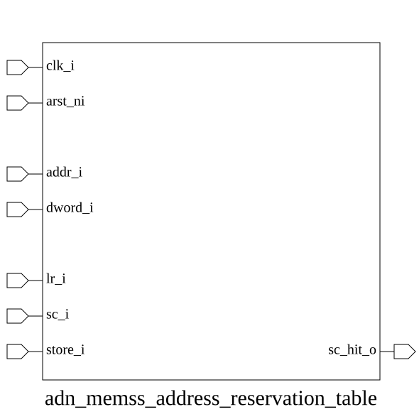

# adn_memss_address_reservation_table (module)

### Author: Adnan Sami Anirban (adnananirban259@gmail.com)

### Source: adn_memss_address_reservation_table.sv

## Top IO

## Parameters

|Name|Type|Dimension|Default|Description|
|-|-|-|-|-|
|AW|int||32|Address width in bits|
|DEPTH|int||4|Number of concurrent reservation entries supported|

## Ports

|Name|Direction|Type|Dimension|Description|
|-|-|-|-|-|
|clk_i|input|logic||System clock|
|arst_ni|input|logic||Asynchronous reset, active low|
|addr_i|input|logic [AW-1:0]||Target address for LR/SC/Store operations|
|dword_i|input|logic||Data size: 1 = 8-byte reservation, 0 = 4-byte|
|lr_i|input|logic||Load-Reserved pulse: trigger new reservation entry|
|sc_i|input|logic||Store-Conditional pulse: evaluate and clear on hit|
|store_i|input|logic||Store/AMO write pulse: invalidate on address overlap|
|sc_hit_o|output|logic||Combinational output: SC operation found a valid reservation|

## Description

# Purpose
This module implements a hardware reservation table designed to track memory address reservations for Load-Reserved (LR) and Store-Conditional (SC) operations. It maintains a set of active reservations and provides mechanisms to validate, invalidate, and clear entries based on incoming memory access patterns, ensuring atomic-like behavior for synchronization primitives.

### Use Case
This module is primarily used in multi-core or multi-threaded processor systems to implement atomic memory operations (Load-Reserved/Store-Conditional). When a processor executes an LR instruction, this module records the target memory address. If a subsequent store or AMO (Atomic Memory Operation) from any agent overlaps with this reserved address, the reservation is invalidated. When the processor attempts an SC instruction, this module checks if the reservation is still valid; if so, the SC succeeds, otherwise, it fails. This mechanism allows for lock-free synchronization primitives like mutexes and semaphores without requiring a global bus lock.

| REVISION | DATE       | AUTHOR          | DESCRIPTION                                            |
|----------|------------|-----------------|--------------------------------------------------------|
| 0.1      | 2026-09-15 | Adnan Sami Anirban | Initial version                                        |
| 1.0      | 2026-09-15 | Adnan Sami Anirban | Stable release                                         |

Author : Adnan Sami Anirban (adnananirban259@gmail.com)
