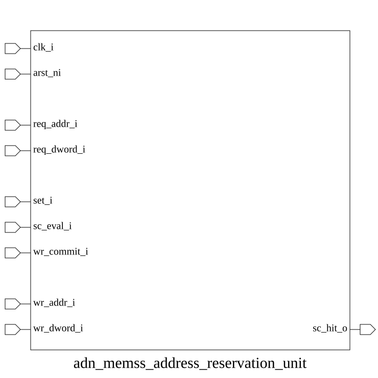

# adn_memss_address_reservation_unit (module)

### Author: Adnan Sami Anirban (adnananirban259@gmail.com)

### Source: adn_memss_address_reservation_unit.sv

## Top IO

## Parameters

|Name|Type|Dimension|Default|Description|
|-|-|-|-|-|
|AW|int||32|Address width|
|DEPTH|int||4|Number of concurrent reservation entries|

## Ports

|Name|Direction|Type|Dimension|Description|
|-|-|-|-|-|
|clk_i|input|logic||Clock|
|arst_ni|input|logic||Asynchronous reset, active low|
|req_addr_i|input|logic [AW-1:0]||Address from LR / SC request|
|req_dword_i|input|logic||Size flag from LR / SC request|
|set_i|input|logic||LR pulse – create reservation|
|sc_eval_i|input|logic||SC pulse – evaluate reservation|
|wr_commit_i|input|logic||Store/AMO write commit pulse|
|wr_addr_i|input|logic [AW-1:0]||Address of the committed write|
|wr_dword_i|input|logic||Size flag of the committed write|
|sc_hit_o|output|logic||Combinational SC hit result|

## Description

@foez---bhai, write the purpose of this module in markdown format here. This is already in multi-line comment, so don't add any additional comment syntax.

@foez---bhai, describe the use case of this module in markdown format here. This is already in multi-line comment, so don't add any additional comment syntax.

| REVISION | DATE       | AUTHOR          | DESCRIPTION                                            |
|----------|------------|-----------------|--------------------------------------------------------|
| 0.1      | 2026-09-15 | Adnan Sami Anirban | Initial version                                        |
| 1.0      | 2026-09-15 | Adnan Sami Anirban | Stable release                                         |

Author : Adnan Sami Anirban (adnananirban259@gmail.com)
