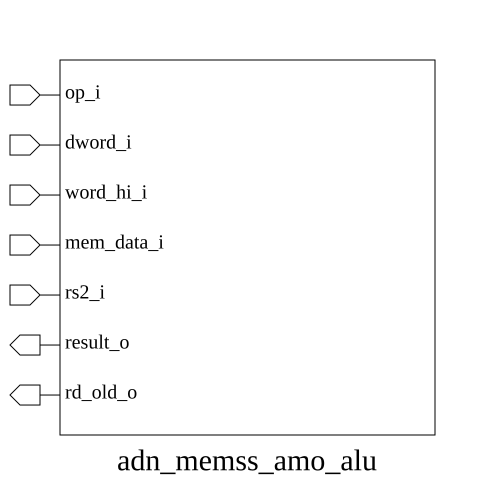

# adn_memss_amo_alu (module)

### Author: Shykul Islam Siam (shykulislam32@gmail.com)

### Source: adn_memss_alu.sv

## Top IO

## Parameters

|Name|Type|Dimension|Default|Description|
|-|-|-|-|-|
|DW|int||64|Configurable memory-data width in bits.|

## Ports

|Name|Direction|Type|Dimension|Description|
|-|-|-|-|-|
|op_i|input|amo_op_t||Atomic memory operation to perform.|
|dword_i|input|logic||Select a full-width operation (64-bit configuration only).|
|word_hi_i|input|logic||Select the upper 32-bit word for word-sized operations.|
|mem_data_i|input|logic [DW-1:0]||Original value read from memory.|
|rs2_i|input|logic [DW-1:0]||AMO source operand used by the operation.|
|result_o|output|logic [DW-1:0]||Value to write back to memory.|
|rd_old_o|output|logic [DW-1:0]||Pre-operation memory value returned to rd.|

## Description

@foez---bhai, write the purpose of this module in markdown format here. This is already in multi-line comment, so don't add any additional comment syntax.

@foez---bhai, describe the use case of this module in markdown format here. This is already in multi-line comment, so don't add any additional comment syntax.

| REVISION | DATE       | AUTHOR          | DESCRIPTION                                            |
|----------|------------|-----------------|--------------------------------------------------------|
| 0.1      | 2026-09-17 | Shykul Islam Siam | Initial version                                        |
| 1.0      | 2026-09-17 | Shykul Islam Siam | Stable release                                         |

Author : Shykul Islam Siam (shykulislam32@gmail.com)
